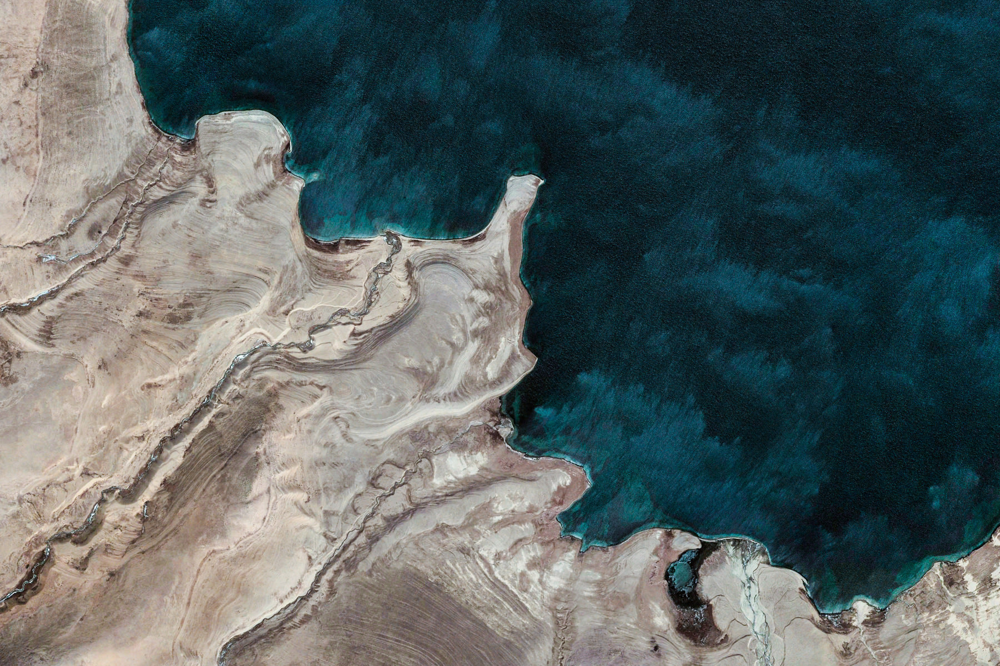

# EarthWallpaper
Download a bunch of images from Google Earth for an awesome wallpaper slideshow

</img>

### Instructions:
Create images folder:
```shell
mkdir images
```
Run script:
```shell
python3 main.py
```
Wait...

And done!
The images folder should contain 2604 images totalling about 2gb
